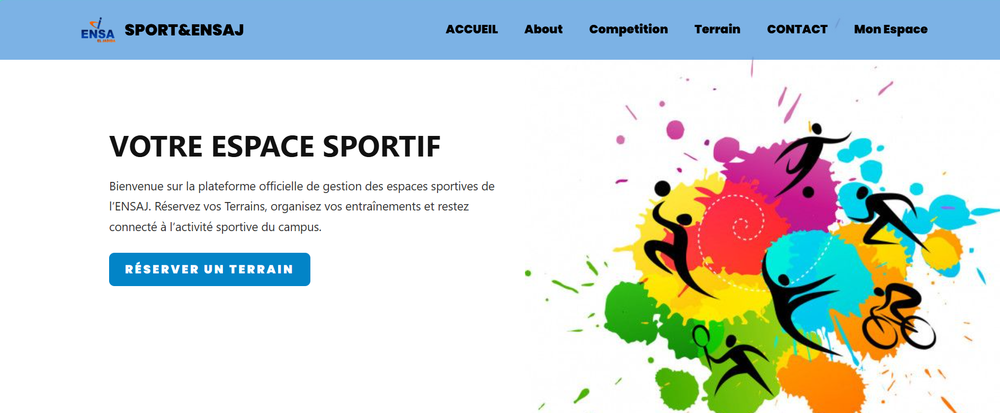
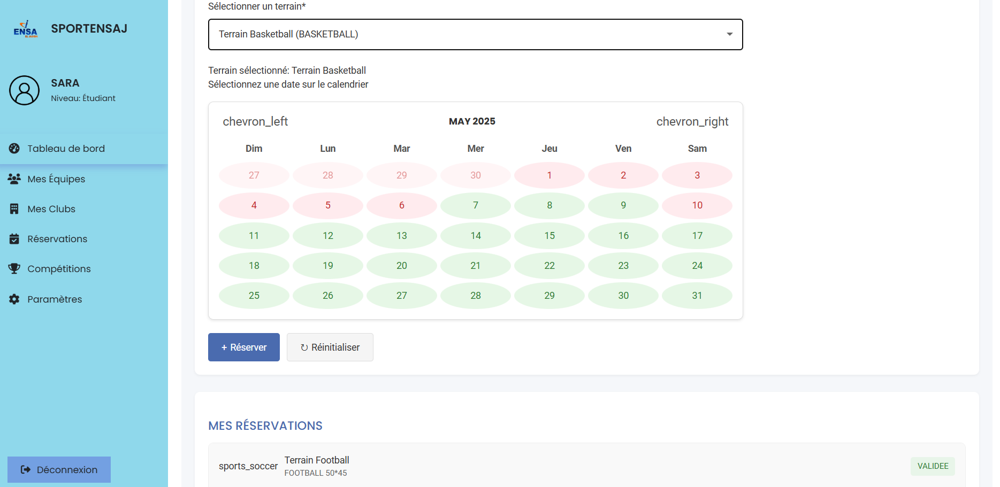
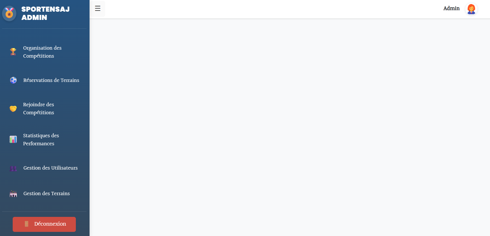

# 🏟️ Projet PFA – Gestion des Espaces Sportifs (ENSAJ)

Application web full-stack développée dans le cadre du **Projet de Fin d’Année (PFA)** pour la gestion des espaces sportifs de l’**École Nationale des Sciences Appliquées d’El Jadida (ENSAJ)**.

La plateforme permet de gérer les terrains sportifs, les réservations, les compétitions, les équipes et les différents profils utilisateurs à travers des espaces dédiés.

---

## 📌 Présentation

L'application est composée de trois éléments principaux :

* **Frontend** : interface web développée avec Angular
* **Backend** : API REST développée avec Spring Boot
* **Base de données** : MySQL

La plateforme propose plusieurs espaces selon le rôle de l'utilisateur :

* 👤 Étudiants et professeurs
* 🛠️ Administrateurs
* 🏆 Responsables

---

## ✨ Fonctionnalités

### 👤 Utilisateurs

* Consultation des terrains sportifs
* Réservation des terrains
* Consultation des calendriers et réservations
* Participation aux compétitions
* Gestion du profil
* Création et gestion des équipes

### 🛠️ Administrateurs

* Tableau de bord d'administration
* Gestion des utilisateurs
* Gestion des terrains
* Gestion des réservations
* Gestion des compétitions
* Gestion des rôles
* Consultation des statistiques

### 🏆 Responsables

* Gestion des équipes
* Gestion des compétitions
* Inscription des étudiants et professeurs
* Gestion des participants

---

## 🛠️ Technologies utilisées

### Frontend

* Angular 16
* Angular Material
* TypeScript
* HTML5
* CSS3

### Backend

* Java
* Spring Boot
* Spring Security
* Spring Data JPA
* Maven

### Base de données

* MySQL
* XAMPP

### Outils

* Git
* GitHub
* Visual Studio Code
* IntelliJ IDEA

---

## 🏗️ Architecture du projet

```text
PFA-Gestion-Espaces-Sportifs/
│
├── frontend/              # Application Angular
│
├── backend/               # API REST Spring Boot
│
├── screenshots/           # Captures d'écran de l'application
│
└── README.md              # Documentation du projet
```

---

## 📸 Captures d'écran

Les principales interfaces de l'application sont présentées ci-dessous.

### 🏠 Page d'accueil



### 🔐 Connexion


### 📅 Réservation d'un terrain



### 🏆 Compétitions


### 🛠️ Tableau de bord administrateur



> Les captures d'écran seront ajoutées dans le dossier `screenshots/`.

---

## ⚙️ Installation et exécution

### 1. Prérequis

Avant de lancer le projet, installer :

* Node.js
* Angular CLI
* JDK Java
* Maven
* MySQL
* XAMPP

---

### 2. Cloner le projet

```bash
git clone https://github.com/Manal-Elagri/PFA-Gestion-Espaces-Sportifs.git
cd PFA-Gestion-Espaces-Sportifs
```

---

### 3. Configuration de la base de données

Lancer **XAMPP** et démarrer le service **MySQL**.

Créer ensuite la base de données utilisée par l'application dans phpMyAdmin.

La configuration de connexion à la base de données se trouve dans :

```text
backend/src/main/resources/application.properties
```

> Les informations sensibles telles que les mots de passe et identifiants doivent être configurées localement et ne doivent pas être publiées sur GitHub.

---

### 4. Lancer le Backend

Depuis le dossier du projet :

```bash
cd backend
```

Puis :

```bash
mvn clean install
mvn spring-boot:run
```

Le backend est disponible par défaut sur :

```text
http://localhost:8080
```

---

### 5. Lancer le Frontend

Dans un nouveau terminal :

```bash
cd frontend
```

Installer les dépendances :

```bash
npm install
```

Puis lancer Angular :

```bash
ng serve
```

L'application est accessible sur :

```text
http://localhost:4200
```

---

## 📡 API REST

Le backend expose plusieurs endpoints REST.

Quelques exemples :

```text
GET  /api/terrains
POST /api/reservations
GET  /api/competitions
POST /api/users/login
```

---

## 🧪 Tests

### Frontend

```bash
ng test
```

### Backend

```bash
mvn test
```

---

## 📦 Déploiement

### Frontend

Construire l'application Angular avec :

```bash
ng build
```

Les fichiers générés peuvent ensuite être déployés sur un serveur web.

### Backend

Générer le fichier JAR avec :

```bash
mvn package
```

Le fichier généré peut ensuite être déployé sur un serveur compatible Java.

---

## 🔒 Sécurité

L'application utilise notamment **Spring Security** pour la gestion de l'authentification et des accès.

Les informations sensibles telles que :

* mots de passe
* identifiants de messagerie
* clés secrètes
* paramètres privés

ne doivent pas être publiées dans le dépôt.

---

## 🚀 Améliorations possibles

Le projet peut être étendu avec :

* Déploiement cloud
* Notifications en temps réel
* Amélioration du système de statistiques
* Système de réservation avancé
* Amélioration de l'expérience utilisateur
* Intégration d'autres services sportifs

---

## 👩‍💻 Auteur

**Manal Elagri**

Ingénieure en Intelligence Artificielle & Informatique

Projet réalisé dans le cadre du **Projet de Fin d’Année – ENSAJ**.

---

## 📄 Licence

Ce projet a été développé dans un cadre académique.
